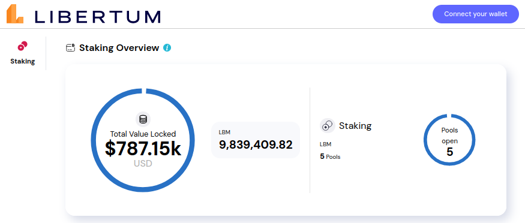
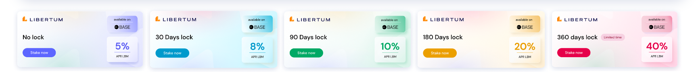
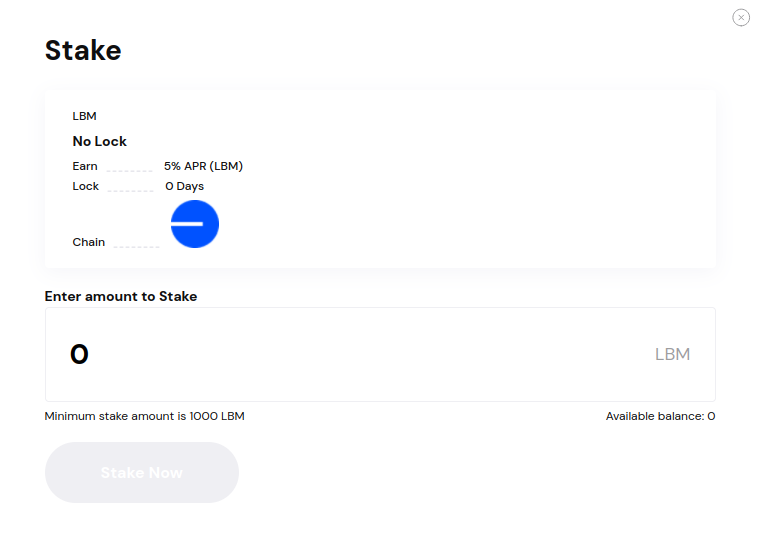

# Staking on Earn
## Earn rewards and secure blockchain networks by staking through Earn.

Staking is the process of holding cryptocurrency in a digital wallet to support the operations of a blockchain network and, in return, earning rewards in the form of additional cryptocurrency tokens. It involves locking up a certain amount of cryptocurrency as a form of investment, contributing to network security, and earning passive income through token rewards.

The Earn app makes staking seamless, empowering you to contribute to the Libertum network's growth and security. Lock up your LBM tokens to earn yields and participate in various staking programs.

---

## Staking Overview
Keep track of your total value locked (TVL) and monitor your active positions on the dashboard.

Web view

---

## Different staking options
 Earn offers four staking pools with varying lockup periods on Base:
- No lockup with 5% APR*
- 90-day lockup with 10% APR*
- 180-day lockup with 25% APR*
- 360-day lockup with 40% APR*

* All APR / APY are paid out in LBM tokens

During the chosen lockup period, your staked tokens are securely locked using smart contracts to ensure the stability of the staking program. Once the initial staking plan concludes, it reverts to a no-lockup plan with a 5% APR.

## Can I access my tokens during the lockup period?

Tokens that are staked cannot be accessed during the lockup period. However, any unstaked tokens can be withdrawn if needed.

## Can I stake tokens on other platforms?

The staking pools are currently accessible and structured similarly across Ethereum, Polygon, and Algorand platforms. In the future, there may be additional options and rewards to incentivize users on different networks.

---

## How does staking work on the Earn platform?
1. Connect your wallet, and stake a minimum of 1000 LBM tokens. Users can unlock several benefits based on the number of tokens held.
2. To stake, select a pool, enter the desired amount, and click ‘Stake Now’ to complete the process.

3. Once staked, your ‘Account Page’ will provide information about the pools, your rewards, earned positions, and active pools.

## Mobile view

---

## Benefits of staking on the Earn platform
Staking on Earn offers rewards, including different APR returns for various staking protocols. By staking tokens, users actively contribute to the scarcity and utility of the token.

## Reward structure of staking on the Earn platform

The reward structure is based on the Annual Percentage Rate (APR), representing the simple interest rate or return over a one-year period. It does not take into account compounding, which means that the interest or return earned is based solely on the initial principal amount.

With the 90-day lockup staking plan, users will receive a 10% APR at the end of the lockup period. The basic staking plan without lockup generates a 5% yearly APR for every 1000 LBM tokens staked, without accounting for compounding interest.

## Why can't I unstake and claim my tokens from my staking protocol?
If the "Unstake & Claim" or "Claim" button do not appear next to the staking protocols shown in "My Positions", please check if you are connected to the wallet of the chain you had made staking pledges in. So as the image shows above, the current wallet is connected to the Base chain and the staking protocols were also made on the Base chain (shown under Chain).

